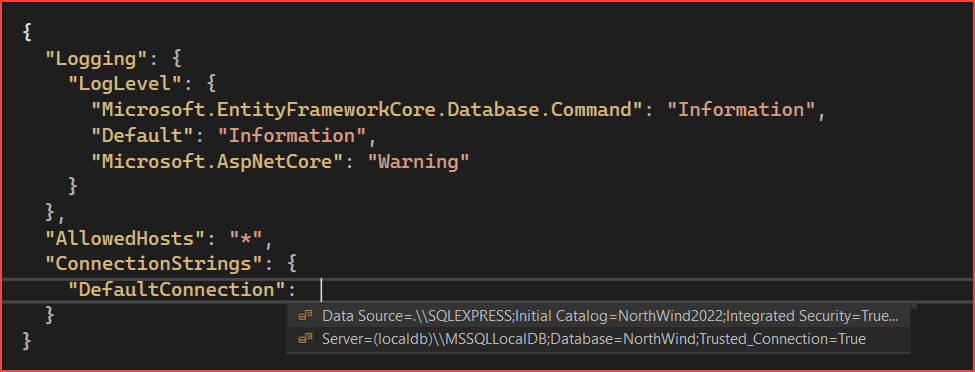
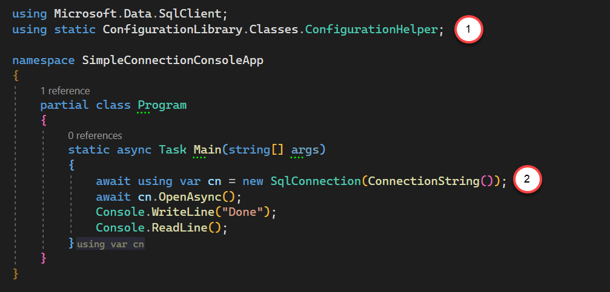
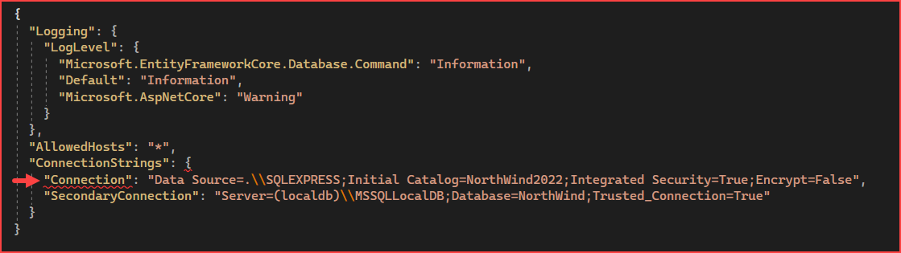
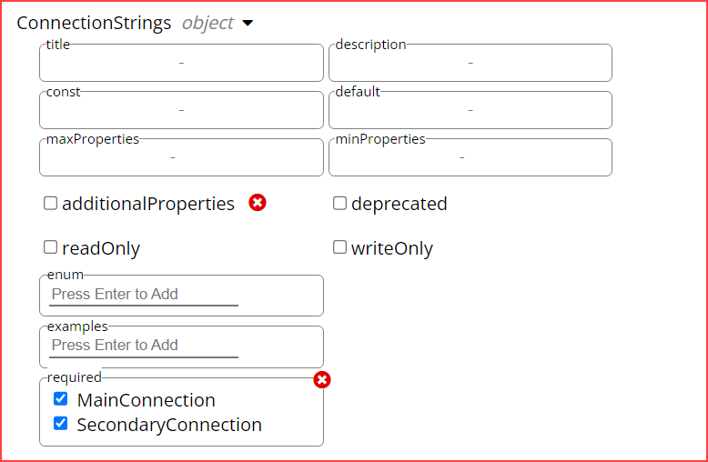
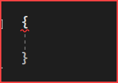
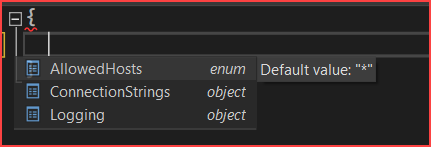

# Visual Studio Appsettings.json schemas

Learn how to create custom schemas for appsettings.json with validation and intellisense.

Validation works best for a team where **code reviews** are performed and that checking the configuration file is part of the review. This provides consistency that abides but team standards.

To appreciate [intellisense](https://learn.microsoft.com/en-us/visualstudio/ide/using-intellisense?view=vs-2022) aspect watch the video below.

<iframe width="560" height="315" src="https://www.youtube.com/embed/Ei_mIzsniLg?si=qxmQJ_TDWL3FJHEx" title="YouTube video player" frameborder="0" allow="accelerometer; autoplay; clipboard-write; encrypted-media; gyroscope; picture-in-picture; web-share" allowfullscreen></iframe>




When creating a new web application, a file named [appsettings.json](https://learn.microsoft.com/en-us/aspnet/core/fundamentals/configuration/?view=aspnetcore-7.0) is included using the following schema.

[https://json.schemastore.org/appsettings.json](https://json.schemastore.org/appsettings.json)

Which is length (in regards to properties e.g. like NLog is included) and in most cases more than needed yet using this schema is fine.

## What is a schema file? 

A file for containing format and structure which

- Describes your existing data format.
- Clear, human- and machine-readable documentation.
- Complete structural validation, useful for automated testing.
- Complete structural validation, validating client-submitted data.


## Creating custom schemas

Although the following are done for console and ASP.NET Core what is presented will work for other project types as it is project agnostics. 

### Example 1 console project

The first step is for a developer to learn the basics of working with schemas.

This can be done by creating a custom configuration file e.g.


```json
{
  "ConnectionsConfiguration": {
    "ActiveEnvironment": "Development",
    "Development": "Data Source=.\\SQLEXPRESS;Initial Catalog=NorthWind2022;Integrated Security=True;Encrypt=False", 
    "Stage": "Stage connection string goes here",
    "Production": "Prod connection string goes here"
  }
}
```

Next figure out C# code to read settings from the configuration above, in this case the author of this article created an [NuGet package](https://www.nuget.org/packages/ConfigurationLibrary/1.0.4?_src=template) designed to write utility applications without dependency injection.

**ActiveEnvironment** tells ConfigurationLibrary to read a connection string for either Development, Stage or Production. This is a required property in appsettings.json when using the schema in SimpleConnectionConsoleApp\LocalSchemas\connectionStrings1.json

**Development** is also a reqirement but not Stage or Production.

To create a connection, in this case to a console project, add the following [NuGet package](https://www.nuget.org/packages/ConfigurationLibrary/1.0.4?_src=template) to the project.

1. Add a static using
1. Add Connection() method to the SqlConnection




This works with any managed data provider.


### Example 2 ASP.NET Core/Razor Pages

The default appsettings.json file included with ASP.NET Core.

```json
{
  "Logging": {
    "LogLevel": {
      "Default": "Information",
      "Microsoft.AspNetCore": "Warning"
    }
  },
  "AllowedHosts": "*"
}
```

Then one for a connection string where most developers leave as DefaultConnection which is fine for one connection yet there may be causes for more connections.

```json
{
  "Logging": {
    "LogLevel": {
      "Default": "Information",
      "Microsoft.AspNetCore": "Warning"
    }
  },
  "AllowedHosts": "*",
  "ConnectionStrings": {
    "DefaultConnection": "Data Source=.\\SQLEXPRESS;Initial Catalog=NorthWind2022;Integrated Security=True;Encrypt=False"
  }
}
```

Using a custom schema an enforcement can be made to change from DefaultConnection to perhaps MainConnection.

```json
{
  "Logging": {
    "LogLevel": {
      "Microsoft.EntityFrameworkCore.Database.Command": "Information",
      "Default": "Information",
      "Microsoft.AspNetCore": "Warning"
    }
  },
  "AllowedHosts": "*",
  "ConnectionStrings": {
    "MainConnection": "Data Source=.\\SQLEXPRESS;Initial Catalog=NorthWind2022;Integrated Security=True;Encrypt=False"
  }
}
```

To keep things simple add a second connection string named SecondaryConnection.

```json
{
  "Logging": {
    "LogLevel": {
      "Microsoft.EntityFrameworkCore.Database.Command": "Information",
      "Default": "Information",
      "Microsoft.AspNetCore": "Warning"
    }
  },
  "AllowedHosts": "*",
  "ConnectionStrings": {
    "MainConnection": "Data Source=.\\SQLEXPRESS;Initial Catalog=NorthWind2022;Integrated Security=True;Encrypt=False",
    "SecondaryConnection": "Server=(localdb)\\MSSQLLocalDB;Database=NorthWind;Trusted_Connection=True"
  }
}
```

In Program.cs

```csharp
builder.Services.AddDbContext<Context>(options =>
    options.UseSqlServer(builder.Configuration.GetConnectionString("MainConnection"))
        .EnableSensitiveDataLogging());
```

## Loose validation

Using the last appsetting.json above which uses MainConnection, a developer can use Connection or whatever they want until there is a code review to enforce the standard, otherwise match this with Program.cs and the connection is still valid.



## Providing options

To provide options specify **enum**.

```json
"enum": [
  "Server=(localdb)\\MSSQLLocalDB;Database=NorthWind;Trusted_Connection=True",
  "Data Source=.\\SQLEXPRESS;Initial Catalog=NorthWind2022;Integrated Security=True;Encrypt=False"
]
```

By providing options or one option

- A developer does not have to type in the connection which could end up with a malformed connection string
- Developers know which are valid connections

## How to create a schema

- First create a json file
- Create class(es) to contain data if needed
- Serialize and deserialize the file
- Test
- Review that the above meets requirements
- Rather than create the schema by hand use a tool.

Recommendation, itential [schema generator](https://json-to-schema.itential.io/).

Once there click on the blue question mark, top right corner of the page to get a walkthrough.

1. Copy desired json in the input on the left side of the page
1. Click infer Schema button
1. A schema appears in the right pane
1. Next open nodes in the left pane and edit as needed

:x: in the top right corner of inputs when clicked removes data for the input.

Example node taken from the json above.



In a test project, create a folder **LocalSchemas** then create an empty json file and copy the schema above into this file and save. Let's call the file **connectionStrings1.json**

At the root folder of the same project, add a new appsettings.json file.

In the new appsettings.json file add

```
LocalSchemas\connectionStrings1.json
```

To the schema input.


Type two Bob Hope brackets and the schema starts validition.



Place the cursor between the brackets and press <kbd>CTRL</kbd>, <kbd>space</kbd> for Intellisense to kick in.



In all is fine the next step is to upload the schema file online and ensure the schema file is available to whomever is going to use the schema.

At the very least a schema file can be hosted in a GitHub repository. Once pushed to the repository, go to raw view and copy then paste to a desired appsettings.json file.


**Caveat** if a new version of a schema file is pushed to the repository and the schema does not validate in the appsettings.json file.

In the schema input at the end type in **?reload** and press enter.


## Resources

- [Storing and reading values from appsettings.json](https://dev.to/karenpayneoregon/storing-and-reading-values-from-appsettingsjson-io)
- [Intellisense for JSON Schema in the JSON Editor](https://devblogs.microsoft.com/dotnet/intellisense-for-json-schema-in-the-json-editor/)
- [JSON Schema Validator](https://www.jsonschemavalidator.net/)
- [Json.NET Schema](https://www.newtonsoft.com/jsonschema)


